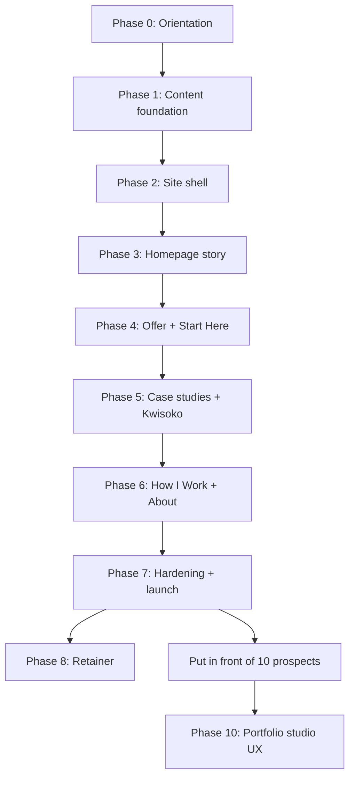

# 07 Rebuild Roadmap

**Project:** The Website Guy — Digital Experience Consultant Platform  
**Stage:** Build  
**Document type:** Phased implementation and learning roadmap  
**Source documents:** `docs/05-ai-rules.md`, `docs/06-mastery-checklist.md`, `docs/04-engineering-design.md`  
**Status:** v3 rebuild Phases 0–9 complete in code; **Phase 10** is the current trajectory (`docs/08-portfolio-studio-redesign-brief.md`)

---

## Purpose

This document turns the mastery checklist into **phased build work** with clear objectives, execution steps, and exit gates.

Use it when you need to know:

- What phase we are in
- What that phase is trying to achieve
- What we build — and deliberately do not build — in that phase
- How to execute it
- Why it comes in this order
- What you must understand before moving to the next phase

This is a learning roadmap. Checkboxes do not mean mastery. Explanation means mastery.

---

## How We Work Every Phase

Each phase follows the same ritual from `docs/05-ai-rules.md` and `docs/06-mastery-checklist.md`:

1. **Read** — relevant checklist rows + engineering design section
2. **Explain** — files, data flow, business rules, common mistakes (before any code)
3. **Build** — only what that phase owns
4. **Review** — walk through what changed in plain English
5. **Gate** — answer the proof-of-mastery questions; if you cannot, stay in the phase

**Rule:** Old portfolio pages stay live until a new route replaces them. Do not delete working code mid-phase.

**Session prompt:** Use the paste-ready prompt in `docs/06-mastery-checklist.md` at the start of each implementation session. Reference the current phase and checklist steps from this document.

---

## Phase Map

| Phase | Name | Checklist steps | Focus |
|---|---|---|---|
| 0 | Orientation | 1–3 | Strategy, positioning, module map — no code |
| 1 | Content foundation | 4–6, 19–20 | Schemas, types, query layer, publish rules |
| 2 | Site shell | 9–10 | Nav, layout, CTA, route stubs |
| 3 | Homepage story | 7–8, 21–22 | Decision-making homepage, editorial visual system |
| 4 | Offer + Start Here | 11, 17–18 | Commercial core — what, when, how much |
| 5 | Case studies + Kwisoko | 12–14 | Proof narrative, first public case study |
| 6 | How I Work + About | 15–16 | Process and credibility without CV framing |
| 7 | Hardening + launch | 23–27, 30–31 | Remove old IA, verify journeys, launch readiness |
| 8 | Retainer | 28–29, R1–R5 | Ongoing Care offer + progression cross-links |
| 9 | Launch journey | 30–31 | Full client path visible — ready for prospects |
| **10** | **Portfolio studio UX** | **32–36** | **Work-first home, editorial case studies, hybrid conversion — `08`** |



**Note:** Phases 0–9 shipped the v3 **commercial** site. Phase 10 implements the studio trajectory in `08` without discarding offer, Start Here, or query architecture from Phases 1–2.

---

## Phase 0 — Orientation

**Checklist steps:** 1, 2, 3  
**Code changes:** None

### Objective

Understand why we are rebuilding and what we are not building — so every later decision has a filter.

### Why this comes first

Without this, the rebuild becomes a portfolio with new copy. The planning documents exist so strategy is not re-decided in every coding session.

### What we do

- Read the six planning docs in priority order
- Lock in the positioning ladder: **Digital Experience Consultant now**, Business Systems Consultant later
- Map business domains to system modules (Public Website, Offer, Case Studies, How I Work, About, Start Here, Founder Publishing)
- Audit what the current codebase keeps vs replaces

### What we deliberately skip

- No new routes, schemas, or components
- No copywriting marathon
- No design polish

### The job of the site (carry this through every phase)

This is not a nicer portfolio. It is not a marketing platform. It is a **decision-making tool**.

A prospect should finish the site thinking:

- Why my website is not working
- What will be investigated
- What I will receive
- Why I should not ask for a website quote first
- What happens next

### Exit gate

You must be able to say:

> "This site is a decision-making tool that helps a lodge owner understand why they should not ask for a website quote first — and the docs tell me what I may and may not build."

**Proof question:** If someone suggests adding a Services page or CRM, can you explain why that is vetoed and which doc wins?

---

## Phase 1 — Content Foundation

**Checklist steps:** 4, 5, 6, 19, 20  
**Code changes:** Yes — schemas, types, query layer

### Objective

Establish where truth lives before building any public page. The CMS owns offer copy, nav, and proof — not JSX.

### Why this comes before pages

If the homepage is built first with hardcoded copy, you learn layout but not architecture. The engineering design requires content access through `lib/content/queries/`. That pattern must exist before pages depend on it.

### What we build

```
lib/content/
  client.ts              ← Sanity client (from existing client-config)
  queries/
    site.ts
    offer.ts
    caseStudies.ts
    howIWork.ts
    about.ts

content/schemas/         ← or sanity/schemas/ — align to engineering design
  siteSettings
  offer (+ deliverables)
  caseStudy
  howIWorkContent
  founderProfile

types/                   ← TypeScript shapes for each schema
```

**Execution steps:**

1. Create `lib/content/client.ts` from existing `sanity/config/client-config.ts`
2. Move query pattern from `sanity/schemas/sanity-utils.ts` into `lib/content/queries/`
3. Add `published == true` filtering on every public query
4. Register new schemas in Sanity; keep old `project` / `service` / `skill` until Phase 5 migration
5. Add TypeScript types under `types/` for each new schema

### What we deliberately skip

- No public page redesign
- No homepage story sections
- No Kwisoko content entry yet (schema only)
- No retainer schema

### Data flow to learn

```
Founder edits in /admin
        ↓
Sanity stores document + publish state
        ↓
lib/content/queries/* fetches published only
        ↓
Route file calls query, passes typed props to component
        ↓
Component renders — it does not own the truth
```

### Exit gate

You must be able to say:

> "If I change the diagnostic price, I edit it in Sanity. The query in `offer.ts` fetches it. The route passes it to the component. Draft content never hits the public site."

**Proof question:** Which file owns publish filtering — the schema, the query, or the component?

**Answer:** The query.

---

## Phase 2 — Site Shell

**Checklist steps:** 9, 10  
**Code changes:** Yes — layout, nav, CTA, route stubs

### Objective

Replace the old single-page hash nav with the new information architecture and a single primary CTA everywhere.

### Why this comes before homepage content

The shell defines how prospects move through the site. Story sections are useless if nav still says Services / Portfolio / Contact.

### What we build

| Route | Status in this phase |
|---|---|
| `/` | Stub or old page still visible — shell wraps it |
| `/digital-experience-diagnostic` | Empty stub route |
| `/case-studies` | Empty stub route |
| `/how-i-work` | Empty stub route |
| `/about` | Empty stub route |
| `/start-here` | Empty stub route |

**Components:**

- `components/layout/SiteHeader` — nav from `siteSettings` query
- `components/layout/SiteFooter` — contact info (salvaged from old footer)
- `components/layout/PrimaryCta` — "Book a Digital Experience Diagnostic" → `/start-here`
- Shared `(site)/layout.tsx` — header + footer on all public routes

**Primary nav:** Digital Experience Diagnostic · Case Studies · How I Work · About · Start Here

### What we deliberately skip

- Homepage story content
- Offer page content
- Removing old `/projects/[project]` yet (deprecated, not deleted)

### Exit gate

You must be able to say:

> "Every public page shares one header, one footer, one primary CTA. Nav comes from CMS, not `data.js`. No page competes with the diagnostic CTA."

**Proof question:** Where does the CTA label live, and what happens if it is wrong in two different places?

---

## Phase 3 — Homepage Story

**Checklist steps:** 7, 8, 21, 22  
**Code changes:** Yes — homepage as decision path

### Objective

Build the homepage as a story, not a nav destination list. Answer: *"Why shouldn't I just ask for a website?"*

### Why this is its own phase

The docs define what pages exist. This phase defines how the homepage **feels** and **decides**. The homepage does the heaviest conversion work.

### Story sequence

```
1. Hero           — "Most businesses don't need a new website…"
2. The Problem    — Website/Facebook/Google/WhatsApp but enquiries are inconsistent
3. The Diagnostic — Eight deliverables (from offer query)
4. How it works   — Investigate → Evidence → Roadmap → Build
5. Case study     — Kwisoko teaser (from caseStudies query)
6. About teaser   — Why this approach exists
7. Final CTA      — Book the Diagnostic
```

Plus an explicit **"Why not just ask for a website?"** block.

### What we build

- `components/home/*` — one component per story section
- `app/(site)/page.tsx` — composes sections; fetches `siteSettings` + offer teaser + featured case study
- Editorial visual system: calm typography, no gallery cards, no decorative circles
- Copy test allowance: "Diagnostic" vs "Audit" may vary in hero only

### Design principle for this phase

Design for lodge owners, church administrators, school owners, and restaurant managers — not for designers.

Prioritise:

- Clarity
- Trust
- Confidence
- Simplicity

Do not let internal references (Stripe, Linear, Notion, etc.) drive identity.

**Historical note:** Phase 3 shipped the decision-story homepage. **Phase 10 (`08`)** replaces that homepage **intent** with the hybrid studio model; keep Phase 3 components as reference until Phase 10 refactors `components/home/*`.

### What we deliberately skip

- Full offer page (teaser only on homepage)
- Full case study detail page
- Dark mode, heavy animation, agency decoration

### Exit gate

You must be able to say:

> "A first-time lodge owner landing on mobile understands the category, the product, and the next step within 90 seconds — without asking 'how much for a website?'"

**Proof question:** Which homepage sections are CMS-driven vs presentation-only?

---

## Phase 4 — Offer Page + Start Here

**Checklist steps:** 11, 17, 18  
**Code changes:** Yes — commercial core

### Objective

Make the diagnostic bookable in the prospect's mind — what they get, by when, for how much, and what happens next.

### Why this comes before full case studies

The productized offer page and Kwisoko are the two highest-leverage launch assets. The offer page answers the commercial question. Start Here closes the loop.

### What we build

**`/digital-experience-diagnostic`**

- All eight deliverables
- Turnaround (~1 week — placeholder OK)
- Price (KX,XXX — placeholder OK)
- 90-minute walkthrough call explanation
- Primary CTA → Start Here

**`/start-here`**

- Offer recap (not a website quote form)
- Deliverables, timeline, price restated plainly
- External intake handoff: email, phone, WhatsApp
- What happens after they reach out

### Eight deliverables (must be listable from memory by end of phase)

1. Customer Journey Audit
2. Website Audit
3. Google Business Profile Audit
4. Review Analysis
5. Competitor Comparison
6. Top Revenue Leaks
7. Prioritized Action Plan
8. 90-Minute Walkthrough Call

### What we deliberately skip

- Payments, booking engine, CRM
- Automated scheduling (external link only is fine)
- Retainer surfacing (Phase 8)

### Exit gate

You must be able to say:

> "A prospect can answer what they get, by when, and for how much without a sales call. Start Here is not a 'get a website quote' page."

**Proof question:** List all eight deliverables from memory. Which is the entry product vs the follow-on?

---

## Phase 5 — Case Studies + Kwisoko

**Checklist steps:** 12, 13, 14  
**Code changes:** Yes — proof system

### Objective

Publish proof in the approved narrative structure — not a portfolio gallery.

### Why this comes after the offer page

Proof supports the offer. A case study without a clear product to buy sends prospects back to "nice work, how much for a site?"

### What we build

**`/case-studies`** — index of published case studies (adapt `Works.jsx` pattern; remove gallery styling)

**`/case-studies/[slug]`** — detail page with narrative blocks:

```
Observation → Evidence → Decision → Implementation → Outcome
```

**Kwisoko** — first published `caseStudy` in Sanity (client permission + redaction before publish)

**Migration:**

- Route from `/projects/[project]` → `/case-studies/[slug]`
- `components/case-studies/*` + Portable Text rendering (adapt `Task.jsx`)

### What we deliberately skip

- Rebuilding every old portfolio project
- Fonts/colors branding sections from old project detail page
- Sensitive unredacted client data

### Exit gate

You must be able to say:

> "Kwisoko shows what was observed, what was built, and what changed. The frontend renders published content only — it does not decide what is safe to show."

**Proof question:** Why are Implementation and Outcome required, not just diagnosis?

---

## Phase 6 — How I Work + About

**Checklist steps:** 15, 16  
**Code changes:** Yes — trust pages

### Objective

Explain process and credibility without overselling management consultancy or turning About into a CV.

### Why this comes after proof

Prospects who have seen the offer and Kwisoko now ask: "Who is this person, and how do they actually work?"

### What we build

**`/how-i-work`**

- Diagnostic process (brief)
- Honest scope boundary: broader business issues may surface, but are not the product today
- Build/implementation as follow-on, not lead message

**`/about`**

- Investigation advantage + implementation advantage
- Founder photo optional — not resume grid, not skills wall

Both pages: CMS-driven from `howIWorkContent` and `founderProfile`.

### Exit gate

You must be able to say:

> "How I Work is not a framework library. About is not a CV. Both support the diagnostic-first positioning."

**Proof question:** What is the honest scope-boundary line on How I Work, and why is it there?

---

## Phase 7 — Hardening + Launch Readiness

**Checklist steps:** 23, 24, 25, 26, 27, 30, 31  
**Code changes:** Yes — cleanup, SEO, journey verification

### Objective

Remove old portfolio surfaces, verify critical journeys, and confirm the site changes the first conversation.

### What we do

- Remove or redirect old single-page sections (`Hero`, `Services`, `Skills`, etc.)
- Redirect `/projects/*` → `/case-studies/*` if needed
- SEO metadata per route (`lib/seo.ts`)
- Walk through SME owner journey and lodge-owner evaluation (checklist steps 30–31)
- Run commercial success check

### Success metric

Do not measure success only by immediate purchases. Measure whether the site changes the first conversation:

> After visiting the site, do they stop asking *"How much for a website?"* and start asking *"Can you look at our business first?"*

### Commercial success check

Before calling the current release done:

- [ ] A prospect can understand the category within seconds on mobile
- [ ] A prospect can answer what they get, by when, and for how much without a sales call
- [ ] The flagship offer page lists all eight deliverables clearly
- [ ] At least one real case study is public and includes implementation and outcome
- [ ] The site does not read like a freelance portfolio or management consultancy
- [ ] The founder can update offer and case study content without rebuilding templates

### Exit gate

You must be able to explain the full current-release architecture to another developer without opening the code.

**Proof question:** Simulate a lodge-owner visit. Where does the site earn trust? Where does it lose it?

---

## Phase 8 — Retainer (After v1)

**Checklist steps:** 28, 29, R1–R5  
**Prerequisite:** Phase 7 complete + conversations with at least 10 real prospects

### Objective

Surface the Ongoing Care / Retainer offer as a standing product — not a buried post-project mention.

### What we build

- `retainerOffer` schema and types
- Retainer surface or section (one chosen route — document before building)
- Diagnostic → build → retainer progression copy
- Founder publishing for retainer content
- Cross-links from Start Here, How I Work, or case studies

### What we deliberately skip

- Billing, ticketing, subscriptions
- Service-desk workflows
- CRM or payment integration

### Exit gate

You must be able to say:

> "Retainer is visible as a standing product. Cross-links explain progression but do not fake billing or subscription flows."

---

## Phase 9 — Launch Journey

**Checklist steps:** 30, 31  
**Prerequisite:** Phases 0–8 complete

### Objective

Verify the full prospect journey end-to-end — referral arrival through diagnostic comprehension to optional ongoing care — without adding new product scope.

### What we built

- `ProgressionPath` on Home, Offer page, and Start Here — Diagnostic → Build → Ongoing Care
- Retainer cross-links on How I Work, Case Studies, and Start Here
- `/ongoing-care` route in sitemap
- Journey reads clearly for SME owners and lodge operators on mobile

### Success metric

After visiting the site, a prospect should ask *"Can you look at our business first?"* — not *"How much for a website?"*

### Exit gate

Simulate a lodge-owner visit. Identify where trust is earned vs lost. Publish Kwisoko and set real pricing before outreach.

---

## Phase 10 — Portfolio Studio UX

**Checklist steps:** 32–36 (`docs/06-mastery-checklist.md`)  
**Governance:** `docs/08-portfolio-studio-redesign-brief.md`  
**Prerequisite:** Phases 0–9 complete (v3 commercial site in code)

### Objective

Redesign public UX so the site reads as a **personal digital studio / body of work**—work-first proof, immersive case studies, **Diagnose → Design → Build → Improve** methodology—while **Book a Digital Experience Diagnostic** remains one click away.

### Why this is its own phase

Phases 1–9 delivered routes, CMS, offer, and proof **structure**. Phase 10 changes **homepage IA**, **proof presentation**, and **visual system** per `08`. This is not a Tailwind-only reskin.

### Homepage sequence (target — hybrid v1)

```text
Hero → Selected Work → How I Think → What I Build → Diagnostic strip → Contact/Start
```

Replace the Phase 3 story scroll (`Problem → Diagnostic → …`) as the **permanent** home model.

### What we build

- Design tokens + `Section` variants + consistent `PrimaryCta`
- Restructured `components/home/*` and `(site)/page.tsx` per `08`
- Large image-forward cards on home + `/case-studies`
- Case study detail: editorial hero, meta row, narrative bands, prev/next, diagnostic UI components (Kwisoko minimum)
- CMS fields on `caseStudy`: category, featured, heroImage, role, context, period, oneLineThesis
- Shell/footer per `08` §18; offer + Start Here restyle
- SEO: OG from hero images where available

### What we deliberately skip (v1)

- Experiments module, filters, articles/Thinking
- Full portable block CMS (v1.5)
- Heavy page transitions or dark-mode toggle

### Design principle

Evidence visible in imagery **and** copy. Performance before animation. Mobile-first sign-off.

### Exit gate

Answer `08` §5 acceptance criteria. Proof question:

> "Would a lodge owner say this is a serious investigator who builds—not another freelancer portfolio?"

And:

> "Can they book the diagnostic in one click without reading the whole site?"

---

## Codebase: Keep vs Replace

Reference for all phases. Salvage infrastructure; replace positioning surface.

### Keep

| Asset | Why |
|---|---|
| Next.js 16 App Router + `(site)` / `(studio)` groups | Matches planned architecture |
| Sanity 5 + next-sanity + `/admin` studio | Founder publishing already works |
| `client-config.ts`, `sanity.config.ts` | Live CMS project |
| `next.config.js` Sanity CDN images | Required for CMS images |
| Query pattern in `sanity-utils.ts` | Becomes `lib/content/queries/` |
| `Task.jsx` Portable Text pattern | Case study rich text |
| Async server component fetch pattern (`Works.jsx`) | Case studies index |
| Contact details in footer | Start Here intake handoff |
| Tailwind color palette (refine, do not discard) | Calm starting point |

### Replace

| Asset | Why |
|---|---|
| `Hero.jsx`, single-page hash IA | Wrong positioning |
| `Services`, `Skills`, `Expertise`, `Education` | Freelancer CV IA |
| `data.js` hardcoded nav | CMS should own nav |
| `Fonts.jsx`, project colors/fonts | Agency portfolio detail |
| `About.jsx` resume framing | Investigation + implementation advantage |
| `service` + `skill` schemas | Out of scope |
| Decorative circles, gallery cards, scale hovers | Agency/portfolio signals |

---

## Mastery Standard (All Phases)

You are not done with a phase when the code works. You are done when you can answer:

1. What problem does this phase solve?
2. Which file owns it and why?
3. What data enters and leaves?
4. What business rule is protected?
5. What is deliberately not included?
6. What would break if this were changed carelessly?

If you cannot answer those questions, do not advance.

---

## Document Chain Position

| Doc | Role |
|---|---|
| `01` Mother diagnostic | Why — frozen strategy |
| `02` Product scope | What fits — scope veto |
| `03` SRS | What it must do |
| `04` Engineering design | How it is shaped |
| `05` AI rules | How to build safely in sessions |
| `06` Mastery checklist | Step-by-step proof of understanding |
| `07` Rebuild roadmap (this doc) | Phased execution order and exit gates |
| **`08` Portfolio studio brief** | **Phase 10 trajectory — experience + v1/v2 scope** |

When implementing, use **this document** for phase context, **`08`** for Phase 10 design decisions, and **06** for step-level detail.

---

*Derived from `docs/05-ai-rules.md`, `docs/06-mastery-checklist.md`, and `docs/04-engineering-design.md` · The Website Guy · July 2026*
